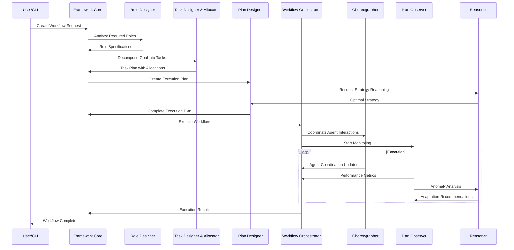

# Feriq Architecture Overview

Comprehensive guide to the Feriq Collaborative AI Agents Framework architecture, featuring 8 core components, comprehensive CLI system, and advanced reasoning capabilities.

## Table of Contents

1. [Architecture Philosophy](#architecture-philosophy)
2. [System Overview](#system-overview)
3. [Core Components](#core-components)
4. [CLI Architecture](#cli-architecture)
5. [Reasoning System](#reasoning-system)
6. [Component Interactions](#component-interactions)
7. [Data Flow & Output Management](#data-flow--output-management)
8. [Scalability and Performance](#scalability-and-performance)
9. [Security and Reliability](#security-and-reliability)
10. [Extension Points](#extension-points)
11. [Deployment Architectures](#deployment-architectures)

## Architecture Philosophy

Feriq is designed around several key architectural principles:

### 1. **Comprehensive Component Integration**
- 8 specialized components each with well-defined responsibilities
- Seamless integration between all framework components
- Comprehensive output tracking and monitoring across all components

### 2. **Reasoning-Enhanced Intelligence**
- Advanced reasoning engines integrated into planning and decision-making
- 10+ reasoning types supporting diverse problem-solving approaches
- Intelligent planning strategies using causal, probabilistic, and collaborative reasoning

### 3. **Professional CLI Interface**
- Complete command-line interface for all framework operations
- Comprehensive listing capabilities with flexible filtering and formatting
- Real-time monitoring and performance tracking through CLI

### 4. **Collaborative Intelligence**
- Agents work together with sophisticated coordination patterns
- Shared context and knowledge enable emergent behaviors
- Cross-component communication and data sharing

### 5. **Adaptive and Learning**
- Components learn from experience and adapt behavior
- Dynamic role assignment based on capabilities and context
- Continuous optimization of workflows and resource allocation

### 6. **Production-Ready Architecture**
- Scalable from single-machine to distributed deployments
- Comprehensive monitoring, logging, and output management
- Multiple output formats and integration capabilities

## System Overview

### High-Level Architecture

```
┌─────────────────────────────────────────────────────────────────────────────┐
│                           🏗️ Feriq Framework                                │
├─────────────────────────────────────────────────────────────────────────────┤
│  ┌─────────────────┐  ┌─────────────────┐  ┌─────────────────┐           │
│  │ 🎭 Role Designer │  │ 📋 Task Designer │  │ 📊 Plan Designer │           │
│  │                 │  │ & Allocator     │  │                 │           │
│  └─────────────────┘  └─────────────────┘  └─────────────────┘           │
│  ┌─────────────────┐  ┌─────────────────┐  ┌─────────────────┐           │
│  │ 👁️ Plan Observer │  │ 🎯 Agent System │  │ 🎼 Orchestrator │           │
│  │                 │  │                 │  │                 │           │
│  └─────────────────┘  └─────────────────┘  └─────────────────┘           │
│  ┌─────────────────┐  ┌─────────────────┐                               │
│  │ 💃 Choreographer │  │ 🧠 Reasoner     │                               │
│  │                 │  │                 │                               │
│  └─────────────────┘  └─────────────────┘                               │
├─────────────────────────────────────────────────────────────────────────────┤
│                        🖥️ Comprehensive CLI System                          │
│  ┌─────────────────┐  ┌─────────────────┐  ┌─────────────────┐           │
│  │ 📋 List Commands │  │ 🧠 Planning     │  │ 🔧 Management   │           │
│  │ • Components    │  │ • Strategies    │  │ • Models        │           │
│  │ • Filtering     │  │ • Analysis      │  │ • Projects      │           │
│  │ • Monitoring    │  │ • Demos         │  │ • Interactive   │           │
```

### Component Output Management

```
┌─────────────────────────────────────────────────────────────────────────────┐
│                          📊 Output Management System                        │
├─────────────────────────────────────────────────────────────────────────────┤
│  outputs/                                                                   │
│  ├── roles/              # 🎭 Role Designer outputs                        │
│  │   ├── role_definitions.yaml                                             │
│  │   ├── role_assignments.json                                             │
│  │   └── role_templates.yaml                                               │
│  ├── tasks/              # 📋 Task Designer & Allocator outputs            │
│  │   ├── task_breakdowns.json                                              │
│  │   ├── task_assignments.json                                             │
│  │   └── allocation_reports.yaml                                           │
│  ├── plans/              # 📊 Plan Designer outputs                        │
│  │   ├── execution_plans.json                                              │
│  │   ├── resource_allocations.yaml                                         │
│  │   └── timeline_schedules.json                                           │
│  ├── observations/       # 👁️ Plan Observer outputs                       │
│  │   ├── execution_logs.json                                               │
│  │   ├── performance_metrics.json                                          │
│  │   ├── status_reports.yaml                                               │
│  │   └── alerts.json                                                       │
│  ├── agents/             # 🎯 Agent System outputs                         │
│  │   ├── agent_configs.yaml                                                │
│  │   ├── goal_progress.json                                                │
│  │   ├── learning_logs.json                                                │
│  │   └── adaptations.yaml                                                  │
│  ├── workflows/          # 🎼 Workflow Orchestrator outputs                │
│  │   ├── workflow_definitions.yaml                                         │
│  │   ├── execution_results.json                                            │
│  │   ├── resource_usage.json                                               │
│  │   └── coordination_logs.json                                            │
│  ├── interactions/       # 💃 Choreographer outputs                        │
│  │   ├── interaction_patterns.yaml                                         │
│  │   ├── communication_logs.json                                           │
│  │   └── coordination_matrices.json                                        │
│  ├── reasoning/          # 🧠 Reasoner outputs                             │
│  │   ├── reasoning_results.json                                            │
│  │   ├── decision_trees.yaml                                               │
│  │   ├── strategic_recommendations.json                                    │
│  │   └── problem_solutions.json                                            │
│  └── actions/            # 🎬 Cross-component actions                      │
│      ├── action_history.json                                               │
│      ├── component_actions.json                                            │
│      └── system_events.json                                                │
└─────────────────────────────────────────────────────────────────────────────┘
```

### Key Architectural Layers

1. **🖥️ CLI Interface Layer**: Comprehensive command-line interface with listing and monitoring
2. **🏗️ Framework Core Layer**: Central coordination and component management
3. **🧩 Component Layer**: 8 specialized framework components working in harmony
4. **🧠 Reasoning Layer**: Advanced reasoning engines integrated across components
5. **📊 Output Management Layer**: Comprehensive tracking and storage of all component outputs
6. **🔧 Foundation Layer**: Core services and infrastructure
7. **🏛️ Base Platform**: CrewAI foundation with enhanced capabilities

## CLI Architecture

### Command Structure

```
feriq
├── init/               # Project initialization
│   └── project
├── list/               # Comprehensive component listing
│   ├── components      # Framework overview
│   ├── roles          # Role designer outputs
│   ├── tasks          # Task designer outputs
│   ├── plans          # Plan designer outputs
│   ├── observations   # Plan observer outputs
│   ├── agents         # Agent configurations
│   ├── workflows      # Workflow orchestrator outputs
│   ├── interactions   # Choreographer outputs
│   ├── reasoning      # Reasoner outputs
│   ├── actions        # Cross-component actions
│   └── generate-samples # Demo data generation
├── plan/              # Reasoning-enhanced planning
│   ├── strategies     # Available planning strategies
│   ├── create         # Create intelligent plans
│   ├── analyze        # Analyze planning requirements
│   └── demo           # Planning demonstrations
├── reason/            # Direct reasoning commands
│   ├── apply          # Apply reasoning to queries
│   ├── analyze        # Reasoning analysis
│   └── types          # Available reasoning types
├── model/             # Model management
│   ├── list           # Available models
│   ├── test           # Test model functionality
│   ├── setup          # Configure models
│   └── pull           # Download models
├── agent/             # Agent management
├── goal/              # Goal management
├── workflow/          # Workflow management
├── status/            # System status
└── interactive/       # Interactive mode
```

### CLI Data Flow

```
┌─────────────────┐    ┌─────────────────┐    ┌─────────────────┐
│   User Input    │ -> │  CLI Commands   │ -> │  Component      │
│                 │    │                 │    │  Actions        │
└─────────────────┘    └─────────────────┘    └─────────────────┘
                                                       │
                                                       ▼
┌─────────────────┐    ┌─────────────────┐    ┌─────────────────┐
│  Format Output  │ <- │   Read Outputs  │ <- │  Generate       │
│  (Table/JSON)   │    │   from Files    │    │  Outputs        │
└─────────────────┘    └─────────────────┘    └─────────────────┘
```

## Reasoning System

### Reasoning Architecture

```
┌─────────────────────────────────────────────────────────────────────────────┐
│                        🧠 Advanced Reasoning System                         │
├─────────────────────────────────────────────────────────────────────────────┤
│  ┌─────────────────┐  ┌─────────────────┐  ┌─────────────────┐           │
│  │ Reasoning Types │  │ Planning        │  │ Decision        │           │
│  │ • Causal        │  │ Integration     │  │ Support         │           │
│  │ • Probabilistic │  │ • 7 Strategies  │  │ • Trees         │           │
│  │ • Temporal      │  │ • Context-Aware │  │ • Recommendations│          │
│  │ • Spatial       │  │ • Optimization  │  │ • Solutions     │           │
│  │ • Collaborative │  │                 │  │                 │           │
│  └─────────────────┘  └─────────────────┘  └─────────────────┘           │
│                                │                                         │
│  ┌─────────────────────────────────────────────────────────────────────────┐  │
│  │                   Reasoning-Enhanced Planning                          │  │
│  │  ┌───────────────┐ ┌───────────────┐ ┌───────────────┐ ┌─────────────┐ │  │
│  │  │   Causal      │ │ Probabilistic │ │   Temporal    │ │   Spatial   │ │  │
│  │  │  Optimized    │ │     Risk      │ │  Sequenced    │ │ Distributed │ │  │
│  │  └───────────────┘ └───────────────┘ └───────────────┘ └─────────────┘ │  │
│  │  ┌───────────────┐ ┌───────────────┐ ┌───────────────┐               │  │
│  │  │ Collaborative │ │   Inductive   │ │     Hybrid    │               │  │
│  │  │  Consensus    │ │    Learned    │ │ Intelligent   │               │  │
│  │  └───────────────┘ └───────────────┘ └───────────────┘               │  │
│  └─────────────────────────────────────────────────────────────────────────┘  │
└─────────────────────────────────────────────────────────────────────────────┘
```

### Reasoning Integration Points

1. **🎭 Role Designer**: Uses reasoning to determine optimal role assignments
2. **📋 Task Designer**: Applies causal reasoning for task dependency analysis
3. **📊 Plan Designer**: Enhanced with reasoning-based planning strategies
4. **👁️ Plan Observer**: Uses probabilistic reasoning for risk assessment
5. **🎯 Agents**: Integrate reasoning capabilities for intelligent decision-making
6. **🎼 Orchestrator**: Uses reasoning for resource optimization
7. **💃 Choreographer**: Applies collaborative reasoning for interaction patterns
8. **🧠 Reasoner**: Core reasoning engine providing services to all components
2. **Framework Core**: Central coordination and management
3. **Component Layer**: Eight specialized components for different aspects
4. **Foundation Layer**: Supporting services and utilities
5. **CrewAI Foundation**: Base agent and task functionality

## Core Components

### 1. Dynamic Role Designer

**Purpose**: Automatically creates and assigns roles based on task requirements and context.

**Architecture**:
```python
class DynamicRoleDesigner:
    def __init__(self):
        self.role_templates = RoleTemplateLibrary()
        self.capability_analyzer = CapabilityAnalyzer()
        self.context_processor = ContextProcessor()
        self.assignment_optimizer = AssignmentOptimizer()
    
    async def design_role(self, task_requirements: TaskRequirements, 
                         context: ExecutionContext) -> Role:
        """Design a role optimized for specific requirements."""
        pass
```

**Key Features**:
- Template-based role generation
- Context-aware capability matching
- Dynamic role adaptation
- Performance-based optimization

### 2. Task Designer & Allocator

**Purpose**: Breaks down goals into tasks and optimally assigns them to agents.

**Architecture**:
```python
class TaskDesignerAllocator:
    def __init__(self):
        self.decomposition_engine = TaskDecompositionEngine()
        self.dependency_analyzer = DependencyAnalyzer()
        self.allocation_optimizer = AllocationOptimizer()
        self.resource_manager = ResourceManager()
    
    async def design_and_allocate(self, goal: Goal, 
                                 available_agents: List[Agent]) -> TaskPlan:
        """Design tasks and allocate to optimal agents."""
        pass
```

**Key Features**:
- Hierarchical task decomposition
- Dependency resolution
- Constraint-based allocation
- Load balancing

### 3. Plan Designer

**Purpose**: Creates comprehensive execution plans with resource allocation and timeline management.

**Architecture**:
```python
class PlanDesigner:
    def __init__(self):
        self.strategy_selector = StrategySelector()
        self.resource_planner = ResourcePlanner()
        self.timeline_generator = TimelineGenerator()
        self.risk_analyzer = RiskAnalyzer()
    
    async def create_plan(self, goal: Goal, constraints: Constraints) -> ExecutionPlan:
        """Create optimized execution plan."""
        pass
```

**Key Features**:
- Multi-strategy planning
- Resource optimization
- Timeline estimation
- Risk assessment and mitigation

### 4. Plan Observer

**Purpose**: Real-time monitoring of plan execution with alerts and performance metrics.

**Architecture**:
```python
class PlanObserver:
    def __init__(self):
        self.metrics_collector = MetricsCollector()
        self.anomaly_detector = AnomalyDetector()
        self.alert_manager = AlertManager()
        self.adaptation_trigger = AdaptationTrigger()
    
    async def observe_execution(self, plan: ExecutionPlan) -> ObservationResult:
        """Monitor and analyze plan execution."""
        pass
```

**Key Features**:
- Real-time metrics collection
- Anomaly detection
- Automated alerting
- Adaptive intervention

### 5. Workflow Orchestrator

**Purpose**: Central coordinator for workflow execution and resource management.

**Architecture**:
```python
class WorkflowOrchestrator:
    def __init__(self):
        self.execution_engine = ExecutionEngine()
        self.coordination_manager = CoordinationManager()
        self.state_manager = StateManager()
        self.recovery_manager = RecoveryManager()
    
    async def orchestrate(self, workflow: Workflow) -> WorkflowResult:
        """Orchestrate complete workflow execution."""
        pass
```

**Key Features**:
- Multi-pattern execution
- State management
- Error recovery
- Resource coordination

### 6. Choreographer

**Purpose**: Manages agent interactions, coordination patterns, and communication protocols.

**Architecture**:
```python
class Choreographer:
    def __init__(self):
        self.pattern_library = CoordinationPatternLibrary()
        self.communication_manager = CommunicationManager()
        self.interaction_optimizer = InteractionOptimizer()
        self.conflict_resolver = ConflictResolver()
    
    async def choreograph(self, agents: List[Agent], 
                         pattern: CoordinationPattern) -> ChoreographyResult:
        """Manage agent coordination and interactions."""
        pass
```

**Key Features**:
- Multiple coordination patterns
- Dynamic pattern switching
- Conflict resolution
- Communication optimization

### 7. Reasoner

**Purpose**: Advanced reasoning engine for decision-making, problem-solving, and strategic planning.

**Architecture**:
```python
class Reasoner:
    def __init__(self):
        self.reasoning_engines = {
            ReasoningType.DEDUCTIVE: DeductiveReasoner(),
            ReasoningType.INDUCTIVE: InductiveReasoner(),
            ReasoningType.PROBABILISTIC: ProbabilisticReasoner(),
            ReasoningType.CAUSAL: CausalReasoner()
        }
        self.meta_reasoner = MetaReasoner()
        self.explanation_generator = ExplanationGenerator()
    
    async def reason(self, problem: Problem, 
                    reasoning_type: ReasoningType) -> ReasoningResult:
        """Apply reasoning to solve problems."""
        pass
```

**Key Features**:
- Multiple reasoning types
- Meta-reasoning capabilities
- Explanation generation
- Confidence assessment

### 8. Agent Manager (Framework Extension)

**Purpose**: Manages agent lifecycle, capabilities, and learning.

**Architecture**:
```python
class AgentManager:
    def __init__(self):
        self.agent_registry = AgentRegistry()
        self.capability_manager = CapabilityManager()
        self.learning_manager = LearningManager()
        self.performance_tracker = PerformanceTracker()
    
    async def manage_agent_lifecycle(self, agent: Agent) -> None:
        """Manage complete agent lifecycle."""
        pass
```

**Key Features**:
- Agent registration and discovery
- Capability tracking and evolution
- Learning and adaptation
- Performance monitoring

## Component Interactions

### Workflow Execution Flow



### Inter-Component Communication

Components communicate through several mechanisms:

1. **Event-Driven Architecture**
   ```python
   class EventBus:
       def __init__(self):
           self.subscribers = defaultdict(list)
       
       def subscribe(self, event_type: str, handler: Callable):
           self.subscribers[event_type].append(handler)
       
       async def publish(self, event: Event):
           for handler in self.subscribers[event.type]:
               await handler(event)
   ```

2. **Shared Context**
   ```python
   class ExecutionContext:
       def __init__(self):
           self.shared_state = {}
           self.metrics = {}
           self.knowledge_base = KnowledgeBase()
       
       def update(self, key: str, value: Any):
           self.shared_state[key] = value
           self.notify_subscribers(key, value)
   ```

3. **Message Passing**
   ```python
   class MessageQueue:
       def __init__(self):
           self.queues = defaultdict(asyncio.Queue)
       
       async def send(self, recipient: str, message: Message):
           await self.queues[recipient].put(message)
       
       async def receive(self, recipient: str) -> Message:
           return await self.queues[recipient].get()
   ```

## Data Flow

### Information Architecture

```
┌─────────────────────────────────────────────────────────────────┐
│                          Data Flow                              │
├─────────────────────────────────────────────────────────────────┤
│                                                                 │
│  Input Layer                                                    │
│  ┌─────────────┐  ┌─────────────┐  ┌─────────────┐            │
│  │ User Input  │  │ Config Files│  │ External    │            │
│  │ (CLI/API)   │  │ (YAML/JSON) │  │ Data Sources│            │
│  └─────────────┘  └─────────────┘  └─────────────┘            │
│         │                 │                 │                  │
│         ▼                 ▼                 ▼                  │
│  ┌─────────────────────────────────────────────────────────┐   │
│  │              Input Validation & Processing              │   │
│  └─────────────────────────────────────────────────────────┘   │
│                            │                                   │
│                            ▼                                   │
│  ┌─────────────────────────────────────────────────────────┐   │
│  │                Framework Core                           │   │
│  │  ┌─────────────┐  ┌─────────────┐  ┌─────────────┐     │   │
│  │  │ Goal        │  │ Task        │  │ Plan        │     │   │
│  │  │ Processing  │  │ Generation  │  │ Creation    │     │   │
│  │  └─────────────┘  └─────────────┘  └─────────────┘     │   │
│  └─────────────────────────────────────────────────────────┘   │
│                            │                                   │
│                            ▼                                   │
│  ┌─────────────────────────────────────────────────────────┐   │
│  │              Component Processing                       │   │
│  │  ┌─────────────┐  ┌─────────────┐  ┌─────────────┐     │   │
│  │  │ Role        │  │ Agent       │  │ Workflow    │     │   │
│  │  │ Assignment  │  │ Allocation  │  │ Execution   │     │   │
│  │  └─────────────┘  └─────────────┘  └─────────────┘     │   │
│  └─────────────────────────────────────────────────────────┘   │
│                            │                                   │
│                            ▼                                   │
│  ┌─────────────────────────────────────────────────────────┐   │
│  │              Execution & Monitoring                     │   │
│  │  ┌─────────────┐  ┌─────────────┐  ┌─────────────┐     │   │
│  │  │ Task        │  │ Performance │  │ Adaptation  │     │   │
│  │  │ Execution   │  │ Monitoring  │  │ Decisions   │     │   │
│  │  └─────────────┘  └─────────────┘  └─────────────┘     │   │
│  └─────────────────────────────────────────────────────────┘   │
│                            │                                   │
│                            ▼                                   │
│  ┌─────────────────────────────────────────────────────────┐   │
│  │              Output Generation                          │   │
│  │  ┌─────────────┐  ┌─────────────┐  ┌─────────────┐     │   │
│  │  │ Results     │  │ Reports     │  │ Learned     │     │   │
│  │  │ Formatting  │  │ Generation  │  │ Knowledge   │     │   │
│  │  └─────────────┘  └─────────────┘  └─────────────┘     │   │
│  └─────────────────────────────────────────────────────────┘   │
│                            │                                   │
│                            ▼                                   │
│  Output Layer                                                  │
│  ┌─────────────┐  ┌─────────────┐  ┌─────────────┐            │
│  │ User        │  │ File        │  │ External    │            │
│  │ Interface   │  │ Output      │  │ Systems     │            │
│  └─────────────┘  └─────────────┘  └─────────────┘            │
└─────────────────────────────────────────────────────────────────┘
```

### Data Models

#### Core Entity Relationships

```python
from dataclasses import dataclass
from typing import List, Dict, Optional, Any
from enum import Enum
from datetime import datetime, timedelta

@dataclass
class Goal:
    """Represents a high-level objective."""
    id: str
    name: str
    description: str
    type: GoalType
    priority: Priority
    estimated_duration: timedelta
    required_capabilities: List[str]
    context: Dict[str, Any]
    created_at: datetime
    
@dataclass
class Task:
    """Represents a specific work unit."""
    id: str
    name: str
    description: str
    goal_id: str
    required_capabilities: List[str]
    dependencies: List[str]
    estimated_duration: timedelta
    status: TaskStatus
    assigned_agent_id: Optional[str]
    
@dataclass
class Agent:
    """Represents an AI agent."""
    id: str
    name: str
    role: Role
    capabilities: Dict[str, float]  # capability -> proficiency level
    status: AgentStatus
    current_tasks: List[str]
    performance_history: List[PerformanceRecord]
    
@dataclass
class ExecutionPlan:
    """Represents a complete execution plan."""
    id: str
    goal_id: str
    tasks: List[Task]
    agent_assignments: Dict[str, str]  # task_id -> agent_id
    execution_strategy: ExecutionStrategy
    timeline: Timeline
    resource_requirements: ResourceRequirements
```

## Scalability and Performance

### Horizontal Scaling

Feriq is designed to scale horizontally across multiple machines:

```python
class DistributedFramework(FeriqFramework):
    """Distributed version of Feriq framework."""
    
    def __init__(self, cluster_config: ClusterConfig):
        self.cluster_manager = ClusterManager(cluster_config)
        self.load_balancer = LoadBalancer()
        self.coordination_service = CoordinationService()
        
    async def distribute_workflow(self, workflow: Workflow) -> DistributedWorkflow:
        """Distribute workflow across cluster nodes."""
        
        # Analyze workflow for distribution opportunities
        distribution_plan = await self.analyze_for_distribution(workflow)
        
        # Allocate resources across nodes
        node_allocations = await self.cluster_manager.allocate_resources(
            distribution_plan.resource_requirements
        )
        
        # Create distributed execution plan
        distributed_workflow = DistributedWorkflow(
            original_workflow=workflow,
            node_allocations=node_allocations,
            coordination_strategy=distribution_plan.coordination_strategy
        )
        
        return distributed_workflow
```

### Performance Optimization

#### Asynchronous Execution

```python
import asyncio
from concurrent.futures import ThreadPoolExecutor, ProcessPoolExecutor

class OptimizedExecutionEngine:
    """High-performance execution engine."""
    
    def __init__(self):
        self.thread_pool = ThreadPoolExecutor(max_workers=50)
        self.process_pool = ProcessPoolExecutor(max_workers=4)
        self.semaphore = asyncio.Semaphore(100)  # Limit concurrent tasks
    
    async def execute_task_optimized(self, task: Task, agent: Agent) -> TaskResult:
        """Execute task with performance optimizations."""
        
        async with self.semaphore:
            if task.is_cpu_intensive():
                # CPU-intensive tasks go to process pool
                loop = asyncio.get_event_loop()
                result = await loop.run_in_executor(
                    self.process_pool,
                    self.execute_cpu_task,
                    task, agent
                )
            elif task.is_io_intensive():
                # IO-intensive tasks go to thread pool
                loop = asyncio.get_event_loop()
                result = await loop.run_in_executor(
                    self.thread_pool,
                    self.execute_io_task,
                    task, agent
                )
            else:
                # Regular async execution
                result = await self.execute_async_task(task, agent)
        
        return result
```

#### Caching and Memoization

```python
from functools import wraps
from typing import Callable
import hashlib
import pickle

class IntelligentCache:
    """Intelligent caching system for framework operations."""
    
    def __init__(self, max_size: int = 1000):
        self.cache = {}
        self.access_times = {}
        self.max_size = max_size
    
    def cache_result(self, ttl: int = 3600):
        """Decorator for caching function results."""
        def decorator(func: Callable):
            @wraps(func)
            async def wrapper(*args, **kwargs):
                # Generate cache key
                cache_key = self.generate_cache_key(func.__name__, args, kwargs)
                
                # Check cache
                if cache_key in self.cache:
                    cached_item = self.cache[cache_key]
                    if not self.is_expired(cached_item):
                        self.access_times[cache_key] = time.time()
                        return cached_item['result']
                
                # Execute function
                result = await func(*args, **kwargs)
                
                # Store in cache
                self.store_in_cache(cache_key, result, ttl)
                
                return result
            return wrapper
        return decorator
    
    def generate_cache_key(self, func_name: str, args: tuple, kwargs: dict) -> str:
        """Generate unique cache key."""
        cache_data = {
            'function': func_name,
            'args': args,
            'kwargs': kwargs
        }
        serialized = pickle.dumps(cache_data)
        return hashlib.md5(serialized).hexdigest()
```

## Security and Reliability

### Security Architecture

```python
class SecurityManager:
    """Manages security aspects of the framework."""
    
    def __init__(self):
        self.auth_manager = AuthenticationManager()
        self.access_control = AccessControlManager()
        self.encryption_service = EncryptionService()
        self.audit_logger = AuditLogger()
    
    async def secure_execution(self, workflow: Workflow, user: User) -> SecureWorkflowResult:
        """Execute workflow with security controls."""
        
        # Authenticate user
        if not await self.auth_manager.authenticate(user):
            raise SecurityException("Authentication failed")
        
        # Check permissions
        if not await self.access_control.check_permissions(user, workflow):
            raise SecurityException("Insufficient permissions")
        
        # Encrypt sensitive data
        secure_workflow = await self.encryption_service.encrypt_sensitive_data(workflow)
        
        # Execute with monitoring
        result = await self.execute_with_audit(secure_workflow, user)
        
        return result
```

### Reliability and Fault Tolerance

```python
class ReliabilityManager:
    """Manages reliability and fault tolerance."""
    
    def __init__(self):
        self.health_monitor = HealthMonitor()
        self.circuit_breaker = CircuitBreaker()
        self.retry_manager = RetryManager()
        self.backup_manager = BackupManager()
    
    async def execute_reliably(self, operation: Callable) -> Any:
        """Execute operation with reliability guarantees."""
        
        # Check system health
        if not await self.health_monitor.is_healthy():
            raise SystemUnavailableException("System health check failed")
        
        # Execute with circuit breaker
        if self.circuit_breaker.is_open():
            raise ServiceUnavailableException("Circuit breaker is open")
        
        try:
            # Execute with retry logic
            result = await self.retry_manager.execute_with_retry(operation)
            
            # Record success
            self.circuit_breaker.record_success()
            
            return result
            
        except Exception as e:
            # Record failure
            self.circuit_breaker.record_failure()
            
            # Attempt recovery
            recovery_result = await self.attempt_recovery(operation, e)
            
            if recovery_result.success:
                return recovery_result.data
            else:
                raise e
```

## Extension Points

### Plugin Architecture

```python
class PluginManager:
    """Manages framework plugins and extensions."""
    
    def __init__(self):
        self.plugins = {}
        self.plugin_registry = PluginRegistry()
        self.dependency_resolver = DependencyResolver()
    
    async def load_plugin(self, plugin_name: str, config: Dict[str, Any] = None):
        """Load and initialize a plugin."""
        
        # Resolve dependencies
        dependencies = await self.dependency_resolver.resolve(plugin_name)
        
        # Load dependencies first
        for dep in dependencies:
            if dep not in self.plugins:
                await self.load_plugin(dep)
        
        # Load plugin
        plugin_class = self.plugin_registry.get_plugin_class(plugin_name)
        plugin_instance = plugin_class(config or {})
        
        # Initialize plugin
        await plugin_instance.initialize(self)
        
        # Register plugin
        self.plugins[plugin_name] = plugin_instance
        
        # Register extension points
        await self.register_extension_points(plugin_instance)
```

### Custom Components

```python
class ComponentFactory:
    """Factory for creating custom components."""
    
    def __init__(self):
        self.component_registry = {}
        self.builders = {}
    
    def register_component_type(self, 
                               component_type: str, 
                               builder: Callable):
        """Register a custom component type."""
        self.builders[component_type] = builder
    
    async def create_component(self, 
                              component_type: str, 
                              config: Dict[str, Any]) -> Component:
        """Create a component instance."""
        
        if component_type not in self.builders:
            raise ComponentTypeError(f"Unknown component type: {component_type}")
        
        builder = self.builders[component_type]
        component = await builder(config)
        
        # Validate component interface
        if not self.validate_component_interface(component):
            raise ComponentValidationError("Component doesn't implement required interface")
        
        return component
```

## Deployment Architectures

### Single Machine Deployment

```yaml
# docker-compose.yml
version: '3.8'
services:
  feriq-framework:
    build: .
    ports:
      - "8080:8080"
    environment:
      - FERIQ_CONFIG_PATH=/app/config/feriq.yaml
    volumes:
      - ./config:/app/config
      - ./data:/app/data
    
  ollama:
    image: ollama/ollama
    ports:
      - "11434:11434"
    volumes:
      - ollama_data:/root/.ollama
    
  redis:
    image: redis:alpine
    ports:
      - "6379:6379"
    
  postgres:
    image: postgres:13
    environment:
      POSTGRES_DB: feriq
      POSTGRES_USER: feriq
      POSTGRES_PASSWORD: feriq
    volumes:
      - postgres_data:/var/lib/postgresql/data

volumes:
  ollama_data:
  postgres_data:
```

### Kubernetes Deployment

```yaml
# kubernetes/feriq-deployment.yaml
apiVersion: apps/v1
kind: Deployment
metadata:
  name: feriq-framework
spec:
  replicas: 3
  selector:
    matchLabels:
      app: feriq-framework
  template:
    metadata:
      labels:
        app: feriq-framework
    spec:
      containers:
      - name: feriq
        image: feriq/framework:latest
        ports:
        - containerPort: 8080
        env:
        - name: FERIQ_CLUSTER_MODE
          value: "true"
        - name: REDIS_URL
          value: "redis://redis-service:6379"
        resources:
          requests:
            memory: "512Mi"
            cpu: "250m"
          limits:
            memory: "1Gi"
            cpu: "500m"
---
apiVersion: v1
kind: Service
metadata:
  name: feriq-service
spec:
  selector:
    app: feriq-framework
  ports:
  - port: 80
    targetPort: 8080
  type: LoadBalancer
```

### Cloud-Native Architecture

```python
class CloudNativeFramework(FeriqFramework):
    """Cloud-native implementation with auto-scaling."""
    
    def __init__(self):
        self.kubernetes_client = KubernetesClient()
        self.metrics_collector = PrometheusMetrics()
        self.auto_scaler = HorizontalPodAutoscaler()
        
    async def handle_load_spike(self, metrics: PerformanceMetrics):
        """Handle sudden increase in load."""
        
        if metrics.cpu_usage > 80 or metrics.memory_usage > 80:
            # Scale up pods
            await self.auto_scaler.scale_up(
                deployment="feriq-framework",
                target_replicas=metrics.recommended_replicas
            )
        
        elif metrics.queue_length > 100:
            # Scale up worker pods specifically
            await self.auto_scaler.scale_up(
                deployment="feriq-workers",
                target_replicas=metrics.recommended_worker_replicas
            )
```

## Future Roadmap

### Planned Enhancements

1. **Advanced AI Integration**
   - Support for GPT-4, Claude, and other advanced models
   - Multi-modal agent capabilities (text, image, audio)
   - Real-time learning and adaptation

2. **Enhanced Collaboration**
   - Cross-organization agent collaboration
   - Federated learning capabilities
   - Blockchain-based agent reputation system

3. **Performance Optimizations**
   - GPU acceleration for inference
   - Edge computing support
   - Quantum computing integration (research)

4. **Enterprise Features**
   - Advanced security and compliance
   - Enterprise integrations (Slack, Teams, etc.)
   - Advanced analytics and reporting

5. **Developer Experience**
   - Visual workflow designer
   - No-code/low-code interfaces
   - Enhanced debugging and profiling tools

### Architecture Evolution

The architecture will evolve to support:

- **Microservices Architecture**: Breaking components into independently deployable services
- **Event Sourcing**: Complete audit trail and time-travel debugging
- **CQRS (Command Query Responsibility Segregation)**: Optimized read/write models
- **Reactive Streams**: Better handling of data streams and backpressure

---

*This architecture overview provides a comprehensive understanding of the Feriq framework's design and implementation. For implementation details, see the [Programming Guide](programming_guide.md).*